# typora-idea-night-theme
typora-idea-night-theme

# readme_zh

**我的 Typora IDEA 雅黑主题**

[toc]

# 1、主题概览

## 1.1 目录

语法：`[toc]` + 回车，自动生成

常规：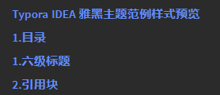

悬停：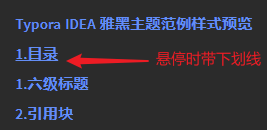

使用：点击自动跳转到该标题

## 1.2 六级标题

> 左对齐，居中对齐感觉有点别扭，去掉下方横线，逐级减小，左侧有几级标题提示（小提示：便于知道下一个标题该写几级标题）
>
> - 语法：`#`、`##`、`###` ... （几级标题，就几个 **#** 号）
>
> - 常规：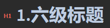
> - 源码格式：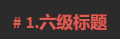
> - 快捷键：`Ctrl + 1~6`

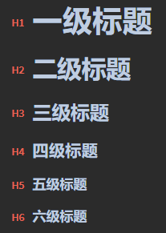

## 1.3 引用块

- 语法：`>` + 空格 （英文大于符号）

> 引用块（可以嵌套） `引用内容`
>
> > 嵌套引用 `引用内容`

## 1.4 超链接

[百度一下](https://www.baidu.com/) 、[京东](https://www.jd.com/)、<颜文字：https://emojixd.com/>

使用方法：

1. 按`Ctrl + K`设置或取消超链接
2. 按住 <kbd>Ctrl</kbd> 键+鼠标单击，将会系统默认浏览器的方式打开，并跳转至该链接地址
3. 也可用 `<` 、`>` 符号将超链接或邮箱引起来

超链接样式：

- 语法：`[超链接文本](要跳转到的超链接地址)`

- 常规：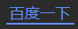
- 鼠标悬停：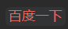
- 打开链接：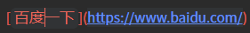

## 1.5 公式

注：公式、上下标、高亮、图表功能，需要在 `设置`- `Markdown` 设置面板中开启

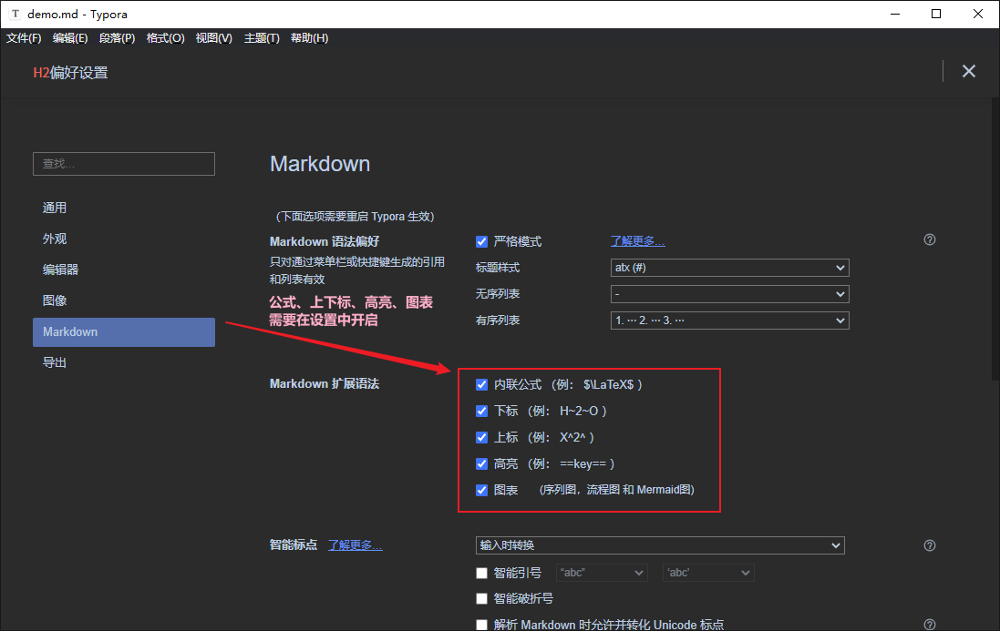

1. 内联公式：$\lim\limits_{x \to \infty} \exp(-x)=0$
   - 语法：`$公式$` ，输入前面一个 `$`，输入公式，即可自动生成公式
   - 格式 - 内联公式，也可自定义快捷键
2. 公式块：（默认居中显示）
   - 语法：`$$公式$$`，输入前两个 `$$` + Enter，输入公式，即可自动生成公式
   - 快捷键：`Ctrl + Shift + M`

$$
E_0 = mc^2 \\
\quad\text{—— Albert Einstein}
$$

==公式语法不会写，强烈推荐新手去这两个链接查看==：[latex手写公式识别](http://draw.mathpix.com/)、[latex公式编辑器](https://www.latexlive.com/)

==插入一些颜文字，可以去==：[https://emojixd.com/](https://emojixd.com/)

## 1.6 列表

### 1.6.1 有序列表

> 语法：`数字.` + 空格，一般 `1.` + 空格
>
> 快捷键：`Ctrl` + `Shift` + `[`
>
> 缩进一级/回退一级：快捷键 `Ctrl` + `]`，`Ctrl` + `[`

1. 有序列表1
   1. 下一级有序列表2
   2. 下一级有序列表2
2. 同级有序列表1

### 1.6.2 无序列表

> 语法：`-` + 空格
>
> 快捷键：`Ctrl` + `Shift` + `]`
>
> 缩进一级/回退一级：快捷键 `Ctrl` + `]`，`Ctrl` + `[`

- 无序列表1
  - 下一级无序列表2
    - 下一级无序列表3
    - 下一级无序列表3

- 同级无序列表1

### 1.6.3 任务列表

> 语法：
>
> - 未选择：`-` + 空格 + `[空格]` + 空格
> - 已选择：`-` + 空格 + `[x]` + 空格

- [ ] 未完成任务1

- [ ] 未完成任务2
- [x] 已完成任务3
- [x] 已完成任务4

## 1.7 文本字体

### 1.7.1 字体

| 字体示例               | 字体样式名称 | 语法                     | 快捷键            |
| ---------------------- | ------------ | ------------------------ | ----------------- |
| **加粗字体**           | 加粗字体     | `**加粗字体**`           | `Ctrl + B`        |
| *斜体字体*             | 斜体字体     | `*斜体字体*`             | `Ctrl + I`        |
| ==高亮字体==           | 高亮字体     | `==高亮字体==`           | 无，可自定义      |
| ==***加粗斜体高亮***== | 加粗斜体高亮 | `==***加粗斜体高亮***==` | 无，可自定义      |
| ~~删除线~~             | 删除线       | `~~删除线~~`             | `Shift + Alt + 5` |
| <u>下划线</u>          | 下划线       | `<u>下划线</u>`          | `Ctrl + U`        |

### 1.7.2 默认标签

| 默认标签示例                                          | 字体样式名称                                           | 语法                                                        | 快捷键       |
| ----------------------------------------------------- | ------------------------------------------------------ | ----------------------------------------------------------- | ------------ |
| <font style="background-color:red">红色标签</font>    | 红色标签（可通过设置`background-color`属性控制背景色） | `<font style="background-color:red">红色标签文本</font>`    | 无，可自定义 |
| <font style="background-color:green">绿色标签</font>  | 绿色标签（可通过设置`background-color`属性控制背景色） | `<font style="background-color:green">绿色标签文本</font>`  | 无，可自定义 |
| <font style="background-color:blue">蓝色标签</font>   | 蓝色标签（可通过设置`background-color`属性控制背景色） | `<font style="background-color:blue">蓝色标签文本</font>`   | 无，可自定义 |
| <font style="background-color:yellow">黄色标签</font> | 黄色标签（可通过设置`background-color`属性控制背景色） | `<font style="background-color:yellow">黄色标签文本</font>` | 无，可自定义 |
| <font style="background-color:gray">灰色标签</font>   | 蓝色标签（可通过设置`background-color`属性控制背景色） | `<font style="background-color:gray">灰色标签文本</font>`   | 无，可自定义 |

### 1.7.3 自定义标签

| 自定义标签示例                       | 字体样式名称         | 语法                                                         | 快捷键       |
| ------------------------------------ | -------------------- | ------------------------------------------------------------ | ------------ |
| <font>红色标签</font>                | 瑰红标签（主题定义） | `<font>红色标签文本</font>` 或 `<font title="red">红色标签文本</font>` | 无，可自定义 |
| <font title="green">绿色标签</font>  | 浅绿标签（主题定义） | `<font title="green">绿色标签文本</font>`                    | 无，可自定义 |
| <font title="blue">蓝色标签</font>   | 淡蓝标签（主题定义） | `<font title="blue">红色标签文本</font>`                     | 无，可自定义 |
| <font title="yellow">黄色标签</font> | 橙黄标签（主题定义） | `<font title="yellow">黄色标签文本</font>`                   | 无，可自定义 |
| <font title="gray">灰色标签</font>   | 暗灰标签（主题定义） | `<font title="gray">灰色标签文本</font>`                     | 无，可自定义 |

### 1.7.4 强调格式

| 自定义强调格式示例                  | 字体样式名称 | 语法                                  | 快捷键       |
| ----------------------------------- | ------------ | ------------------------------------- | ------------ |
| <span alt="underline">下划线</span> | 下划线       | `<span alt="underline">下划线</span>` | 无，可自定义 |
| <span alt="emp">着重号</span>       | 着重号       | `<span alt="emp">着重号</span>`       | 无，可自定义 |
| <span alt="wavy">波浪线</span>      | 波浪线       | `<span alt="wavy">波浪线</span>`      | 无，可自定义 |
| <span alt="hide">隐藏文本</span>    | 隐藏文本     | `<span alt="hide">隐藏文本</span>`    | 无，可自定义 |

### 1.7.5 其它字体样式

源于网上，网上一大堆，不再一一列举

| 其它字体样式示例                    | 字体样式名称 | 语法                                  | 快捷键       |
| ----------------------------------- | ------------ | ------------------------------------- | ------------ |
| <span alt="rainbow">彩虹字体</span> |              | `<span alt="rainbow">彩虹字体</span>` | 无，可自定义 |
| <span alt="modern">模型字体</span>  |              | `<span alt="modern">模型字体</span>`  | 无，可自定义 |
| <span alt="shake">抖音字效</span>   |              | `<span alt="shake">抖音字效</span>`   | 无，可自定义 |

## 1.8 代码块

> 语法：**```语言** + Enter
>
> 快捷键：`Ctrl + Shift + K`

### 1.8.1 Java 代码

```java
package com.baidu.java8;
import org.junit.Test;
import java.util.*;

/**
 * Java 文本注释
 */
public class TestLambda4 {
    /*
    * Java 多行注释
    */
    @Test
    public void test1() {
        happy(10000, (m) -> System.out.println("买手机，消费：" + m + " 元"));
    }

    // Java 单行注释
    public void happy(double money, Consumer<Double> con) {
        con.accept(money);
    }
}
```

### 1.8.2 CSS 代码

```css
/** css 注释 */
#write code,div code {
    padding: 2px 4px;
    border-radius: 2px;
    /*font-family: '微软雅黑';*/
    font-family: var(--code-font);
    font-size: 0.9rem;
    color: var(--code-color);
    background-color: var(--codebg-color);
}
```

### 1.8.3 HTML 代码

```html
<!---->
<!-- HTML 注释 -->
<!DOCTYPE html>
<html lang="en">
<head>
    <meta charset="UTF-8">
    <title>Title</title>
</head>
<body>
<h1>baidu</h1>
</body>
</html>
```

### 1.8.4 JS 代码

```js
// js 注释
function Person(first, last, age, eye) {
    this.firstName = first;
    this.lastName = last;
    this.age = age;
    this.eyeColor = eye;
}
```

### 1.8.5 SQL 代码

```sql
-- SQL 注释
# SQL 注释
SELECT LastName,FirstName FROM Persons
SELECT ProductName, UnitPrice, FORMAT(Now(),'YYYY-MM-DD') as PerDate
FROM Products
```

### 1.8.6 XML 代码

```xml
<!--  XML 注释  -->
<breakfast_menu>
    <food>
        <name>Belgian Waffles</name>
        <price>$5.95</price>
        <description>two of our famous Belgian Waffles</description>
        <calories>650</calories>
    </food>
</breakfast_menu>
```

### 1.8.7 PHP 代码

```php
// PHP 单行注释
# PHP 单行注释

/*
PHP 多行注释块
*/
<?php
$con = mysql_connect("localhost","peter","abc123");
if (!$con)
  {
  die('Could not connect: ' . mysql_error());
  }

mysql_select_db("my_db", $con);

mysql_query("DELETE FROM Persons WHERE LastName='Griffin'");

mysql_close($con);
?>
```

### 1.8.8 Python 代码

```python
# Python 注释
def decorator(func):
    def wrapper(*args, **kwargs):
        ...
        return func(*args, **kwargs)
    return wrapper
```

### 1.8.9 C 代码

```c
// C 单行注释
#include <stdio.h>
void bubble_sort(int arr[], int len) {
    int i, j, temp;
    for (i = 0; i < len - 1; i++)
        for (j = 0; j < len - 1 - i; j++)
            if (arr[j] > arr[j + 1]) {
                temp = arr[j];
                arr[j] = arr[j + 1];
                arr[j + 1] = temp;
            }
}

/** C 多行注释 */
int main() {
    int arr[] = { 22, 34, 3, 32, 82, 55, 89, 50, 37, 5, 64, 35, 9, 70 };
    int len = (int) sizeof(arr) / sizeof(*arr);
    bubble_sort(arr, len);
    int i;
    for (i = 0; i < len; i++)
        printf("%d ", arr[i]);
    return 0;
}
```

### 1.8.10 C++ 代码

```c++
// C++ 单行注释
#include <iostream>
// C++ 多行注释
#include <pthread.h>
 
using namespace std;
 
#define NUM_THREADS 5
 
// 线程的运行函数
void* say_hello(void* args)
{
    cout << "Hello Runoob！" << endl;
    return 0;
}
 
int main()
{
    // 定义线程的 id 变量，多个变量使用数组
    pthread_t tids[NUM_THREADS];
    for(int i = 0; i < NUM_THREADS; ++i)
    {
        //参数依次是：创建的线程id，线程参数，调用的函数，传入的函数参数
        int ret = pthread_create(&tids[i], NULL, say_hello, NULL);
        if (ret != 0)
        {
           cout << "pthread_create error: error_code=" << ret << endl;
        }
    }
    //等各个线程退出后，进程才结束，否则进程强制结束了，线程可能还没反应过来；
    pthread_exit(NULL);
}
```

### 1.8.11 其它代码块

```diff
+ 新增行
- 删除行
其他行
```

## 1.9 表格

| 表头1  | 表头2 | 表头3 |
| :----- | :---: | ----: |
| 奇数行 |  列   |    列 |
| 偶数行 |  ...  |   ... |
| ...    |       |       |
| ...    |       |       |

## 1.10 上下标

1. 上标：e^2^，e^x^
   - 语法：`x^上标^` （x：任意字符、文本，上标也可以是任意字符、文本）
2. 下标：H~2~，O~2~，H~2~O，H~52~O~12\ 22\ 78~ （若下标是多个单词或字符，需使用 `\` 转义空格，显示特殊字符一般都需要反斜杠 `\` 转义）
   - 语法：`x~下标1\ 下标2~` （x：任意字符、文本，上标也可以是任意字符、文本）
3. 拼音文字：（很少使用，没啥用）下方文字 (上方文字) <ruby>下方文字<rp> (</rp><rt>上方文字</rt><rp>) </rp></ruby>、拼音文字 (Pīn yīn wén zì) <ruby>拼音文字<rp> (</rp><rt>Pīn yīn wén zì</rt><rp>) </rp></ruby>、没卵用 (使い物にならない) <ruby>没卵用<rp> (</rp><rt>使い物にならない</rt><rp>) </rp></ruby>
   - 语法：`<ruby>拼音文字<rp> (</rp><rt>Pīn yīn wén zì</rt><rp>) </rp></ruby>`（原理：就是两种文字叠加，没卵用）

## 1.11 图片

图片居左显示，可以设置图片大小、是否阴影、模糊等

- 语法：``（右键也可以缩放图片，任意缩放图片：style="zoom: 任意比例%，显示阴影：alt="shadow"，模糊：alt="blur"）


## 1.12 嵌入音视频

### 1.12.1 嵌入音频

注：我这里是相对路径，音乐文件是本地音乐文件，嵌入外链似乎不得行

```html
语法：
<!-- 方式 ① -->
<audio src="./本地音乐文件路径/xxx.mp3"></audio>

<!-- 方式 ② -->
<audio controls="controls">
  <source src="./本地音乐文件路径/xxx.mp3" type="audio/mp3" />
</audio>

若需要居中显示，可以将 <audio> 音频包裹在<center></center> 中，如下所示：
<center><audio src="./temp/她的微笑.mp3"></audio></center>
    
嵌入外链，语法大致是：//music.163.com/outchain/player?type=2&id=1342183925&auto=0 为外链音乐文件，我试了一下网易云，没能成功，播放不了
<iframe frameborder="no" border="0" marginwidth="0" marginheight="0" src="//music.163.com/outchain/player?type=2&id=1342183925&auto=0"></iframe>
```

<audio src="./temp/她的微笑.mp3"></audio>

<audio controls="controls">
  <source src="./temp/你能不能不要离开我 (莫叫语版)-莫叫姐姐.mp3" type="audio/mp3" />
</audio>

### 1.12.2 嵌入视频

```html
语法：
<video src="./本地视频文件路径/xxx.mp4"></video>
```

<video src="./temp/航拍风景.mp4"></video>

### 1.12.3 折叠标签

语法：

```html
<details>
    <summary>折叠标签</summary>
    <!-- 折叠标签内容 -->
      越人歌
    佚名 〔先秦〕
    今夕何夕兮，搴舟中流。
    今日何日兮，得与王子同舟。
    蒙羞被好兮，不訾诟耻。
    心几烦而不绝兮，得知王子。
    山有木兮木有枝，心悦君兮君不知。
</details>
```

<details>
    <summary>越人歌</summary>
    佚名 〔先秦〕
    今夕何夕兮，搴舟中流。
    今日何日兮，得与王子同舟。
    蒙羞被好兮，不訾诟耻。
    心几烦而不绝兮，得知王子。
    山有木兮木有枝，心悦君兮君不知。
</details>


**更多关于Typora对HTML的支持，请看官方文档**：[https://support.typora.io/HTML/](https://support.typora.io/HTML/)

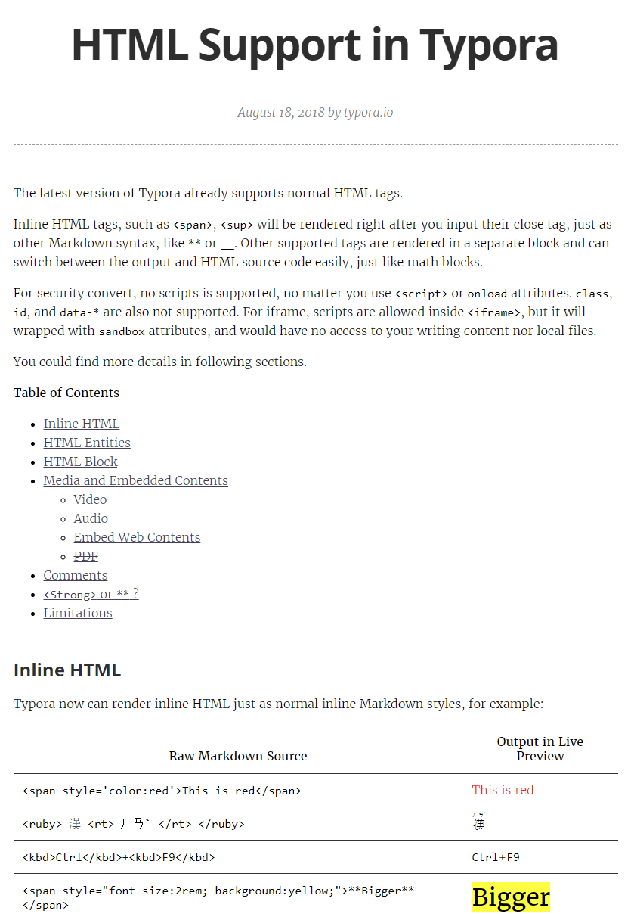

## 1.13 表情符号

**表情符号，去看这个链接**：[https://www.webfx.com/tools/emoji-cheat-sheet/](https://www.webfx.com/tools/emoji-cheat-sheet/)

"微笑"：:smile:（`:smile:`），"笑哭"：&#128514;（`&#128514;`）、&#x1F602;（`&#x1F602;`）......

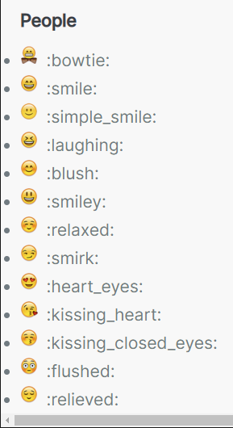

## 1.14 饼图

语法：（这里仅举例说明，更多自己参考[官方文档](https://www.webfx.com/tools/emoji-cheat-sheet/)）

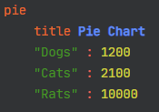

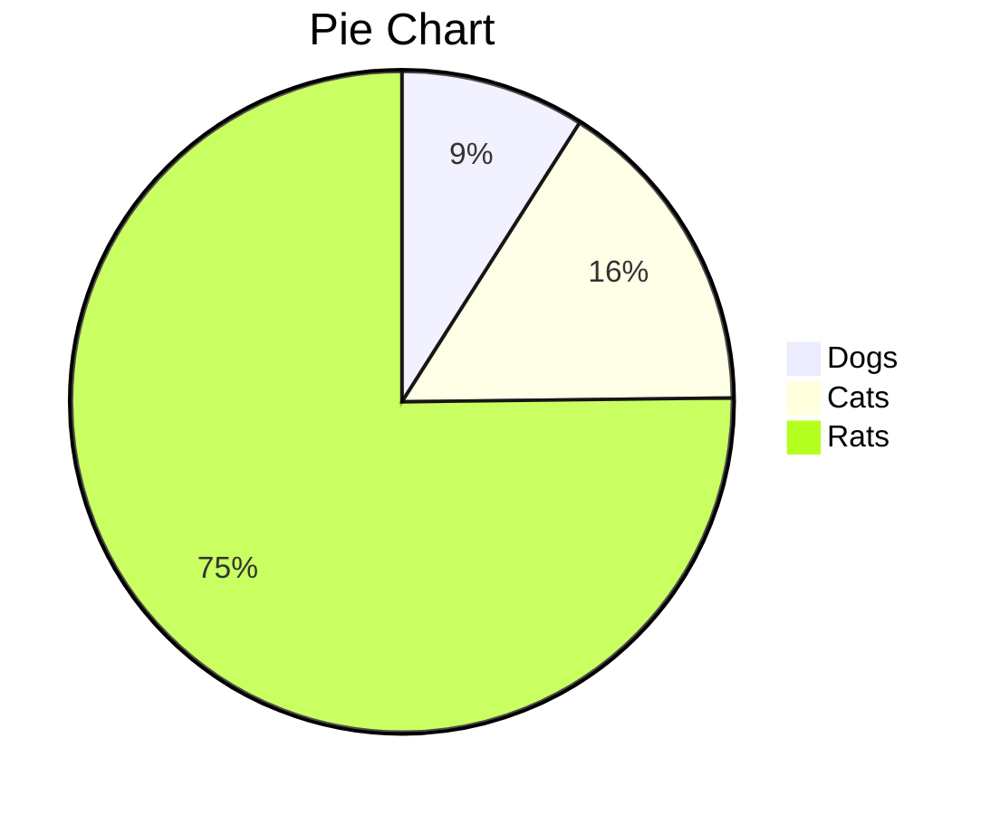

## 1.15 分割线

语法：`---` + Enter 或 `*** ` + Enter

---

## 1.16 页宽

原页宽较窄，这里修改为宽度可铺满 `1920 * 1080` 的屏幕，通过修改 `max-width` 的值即可。

因我习惯看 4k 或 2k 屏，所以，设置为了 1920 * 1080，若不需要页面宽一点儿的话，也可以设置小一点，比如：720 px 就可以，或者 将 #wite 给注释了也行，这样的话，就是默认值了，即没修改的状态。默认值估计在 640 px 或 720 px 附近，因我没去仔细测试，但我简单看了一下，大概在这个区间波动。


# 2、主题安装

## 2.1 下载主题

SSH 链接：[git@github.com:CVNIWORE/typora-idea-night-theme.git](git@github.com:CVNIWORE/typora-idea-night-theme.git)

HTTPS 链接：[https://github.com/CVNIWORE/typora-idea-night-theme.git](https://github.com/CVNIWORE/typora-idea-night-theme.git)

下载好后，解压

## 2.2 应用主题

### 2.2.1 安装字体

==建议安装==（应用到代码中，目前这两款字体还可以，这里仅针对 Windows 系统而言，Mac 的话自带的字体就很好看了）：

1. Source Sans Pro （Adobe 公司免费开源的一款创意设计方面的字体）
2. JetBrains Mono （Jetbrains 公司专为开发者打造的免费开源编程字体）

**安装字体的方法**

1. 选择字体文件，`右键安装`（==不推荐==）
2. 选择字体文件，`右键快捷方式安装`（==推荐==）

> 注：
>
> 1.第 ① 种方式：
>
> - 直接`安装`的方式，无需设置
>
> - 安装，会将字体文件放到 C 盘系统的字体路径下，耗系统资源，且，若需要安装的字体很多，字体文件也比较大的话，有可能造成系统臃肿、卡涩等问题。因此，**此方案不适宜**。
>
> 2.第 ② 种方式：
>
> - 带`快捷方式安装`，就是有快捷方式的字样（若没有 `快捷方式` 的字样，说明当前操作系统未开启 `快捷方式安装字体` 的方式），需要手动开启设置一下，一般默认是未开启的，下面有开启方法。
>
> - 安装，以快捷方式安装，不会直接放置源字体文件，而是放置的安装字体的快捷方式，此方式占用资源很小，很好的弥补第 ① 种方式的缺点，尤其是，当需要安装成千上万的字体时，此方案会明显更佳。
> - 一般情况下，都不会直接安装字体，都会以快捷方式安装。
> - 另外，这种方式，字体可以放在自己喜欢的任意路径下。因此，**推荐此方案**。

**开启字体快捷方式安装的方法**

按 `Win 徽标键` --> 搜索 “`控制面板`” 或 “`control`” --> 点击打开，进入控制面板，右上角，查看方式，选择小图标，然后在面板中，找到 `字体` 选项 --> 点击打开，进入字体窗口，在左上角，找到并打开 `字体设置` --> 在 字体设置面板 - `安装设置` 中，勾选 `允许使用快捷方式安装字体（高级）` 选项 --> 点击确定。勾选之后，在安装字体时，便有以 `快捷方式` 安装字体的方式了，不勾选，是没有的。

### 2.2.2 拷贝粘贴文件

#### 2.2.2.1 base-control.css

之所以要 拷贝 - 粘贴 这个文件，是解决一个官方未注意的小问题，代码块代码字体颜色被覆盖的问题。

拷贝解压的 `base-control.css` 文件，进入 `Typora 安装目录\resources\style\ 路径`下（右键 Typora 桌面图标 - 打开文件所在位置 - 进入 resources 目录 - 进入 style 目录），可以`将原来的 base-control.css 备份`一下，（如：重命名为 `base-control.css_original`），粘贴之前解压的 `base-control.css` 文件即可。

#### 2.2.2.2 Preferences.962926a4.caf99372.chunk.css

同理，将 `Preferences.962926a4.caf99372.chunk.css` 文件，先==备份==，`拷贝` - `粘贴` 到  `Typora 安装目录\resources\page-dist\static\css\ 路径`下即可

### 2.2.3 打开主题文件夹

`打开 Typora` --> `文件` -->  `偏好设置`（Ctrl + ，） --> `外观` --> `打开主题文件夹`（右侧主题栏） --> `拷贝解压后的文件和文件夹`，`粘贴到主题路径下`（即：粘贴到打开主题文件夹的当前路径） --> `退出并重启 Typora` --> 在`主题`菜单栏中，选择 `Idea Night` 主题

## 2.3 设置主题

**建议设置**：（仅作参考）

1. 通用

   - 保存&恢复：勾选`自动保存`（手动保存一是麻烦，二是突发情况易丢失数据文件等）
   - 更新：取消勾选 `自动检查更新`，一般要安装新版本，我习惯自己去官网重新下载，卸载旧版本后再安装新版本，这样，装哪，怎么配置等自己心里有数，默认自动更新安装，心里没数，不知道它悄悄动了哪些东西。
   - 快捷键：自定义快捷键（可以自己定义，这里不作过多说明）
   - 高级设置：
     - 取消勾选 `发送匿名使用数据`
     - 打开高级设置（自己爱设置就设置）

2. 外观

   - 窗口：经典
   - 字体大小：自定义 `16` px （因我安装了 Source Sans Pro、JetBrains Mono 字体，感觉16 px 正合适，这个看你自己，根据自己的实际情况而定）
   - 状态栏：显示状态栏
   - 侧边栏：勾选 `侧边栏的大纲视图允许折叠和展开`
   - 主题：
     - 选项中的主题，就是当前使用的主题
     - 打开主题文件夹，这里一般自定义修改主题、调试主题时，会经常用到
     - 获取主题：就是官网附属的那些主题，个人觉得，没一个适合自己的

3. 编辑器

   - 使用成对的符号：
     - 勾选 `匹配括号和引号`（一般成对书写较好些）
     - 勾选 `匹配 Markdown 字符`（更加便于书写 markdown 的文章）
   - 即时渲染：勾选 `显示当前块元素的 Markdown 源码`（编辑时，可以方便快速查看源码）
   - 拼写检查：选择 `不使用拼写检查`（我不太习惯有拼写检查，若自己可以接受，也可以开启自动检查）

4. 图像

   - 插入图片时：

     - 选择 `复制图片到 ./${filename}.assets 文件夹`（我一般都选它，它会将文章中所有图片存放在一个 xxx.assets 的文件夹中，方便统一管理图片。默认在 C 盘，当然也可以自定义存放图片目录路径）
     - 勾选 `对本地位置的图片应用上述规则`
     - 勾选 `对网络位置的图片应用上述规则`
     - 勾选 `优先使用相对路径`

     - 允许根据 YAML 设置自动上传图片（这个若需要上传图片，可以开启，不需要，就不勾选）
     - 插入时自动转义图片URL（这个也是若需要转义，就转义，不需要，就不勾选）

   - 上传服务设定

     - 上传服务：需要上传服务，自己开启一种方式即可

5. Markdown

   - Markdown 扩展语法
     - 内联公式：勾选 `内联公式`
     - 勾选 `下标`
     - 勾选 `上标`
     - 勾选 `高亮`
     - 勾选 `图表`
   - 代码块
     - 勾选 `显示行号`
     - 勾选 `代码块自动换行`

   基本设置就这些，一切还是要根据自己的实际情况、个人爱好、习惯等，具体配置。

发现一个 ==BUG==：

- 在 `文件` --> `偏好设置` --> 设置面板左上角，==查找搜索框无法使用==，一旦输入查找内容，设置面板就空白一片，什么也没有，设置面板就无法使用，必须重启 Typora，才能使用设置面板，但仍然无法使用设置面板的查找功能，一旦使用，就会陷入死循环，必须重启 Typora 软件。
- 建议：暂时不要去使用 设置面板的查找功能（一般也不会去使用，影响不大）。

# 3、主题效果

**效果图 ①**

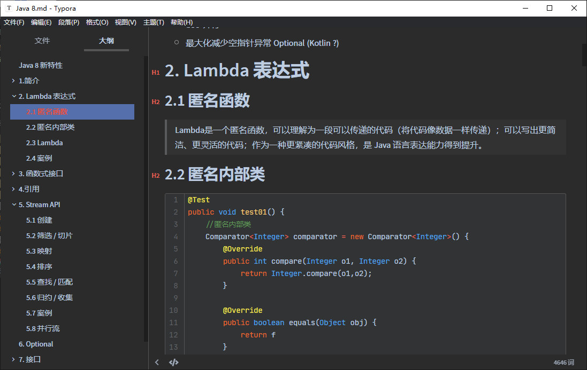

**效果图 ②**

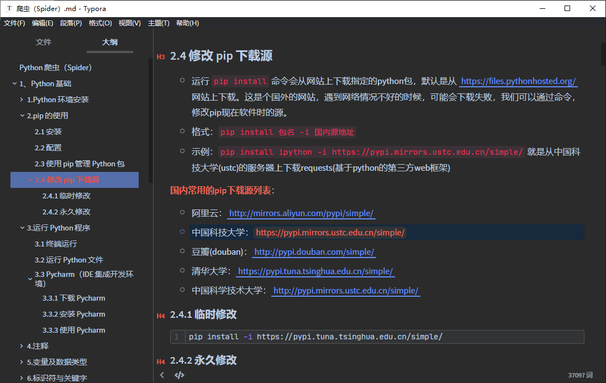

[^1]: Typora 官方下载地址：https://typora.io/#download
[^2]: Typora 官方官方支持文档：https://support.typora.io/
[^3]: Typora 官网附属的一些主题：https://theme.typora.io/

