# 我的 Typora IDEA 雅黑主题

[toc]

# 1.目录

语法：`[toc]` + 回车，自动生成

常规：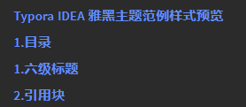

悬停：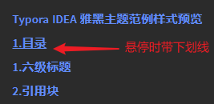

使用：点击自动跳转到该标题

# 2.六级标题

> 左对齐，居中对齐感觉有点别扭，去掉下方横线，逐级减小，左侧有几级标题提示（小提示：便于知道下一个标题该写几级标题）
>
> - 语法：`#`、`##`、`###` ... （几级标题，就几个 **#** 号）
>
> - 常规：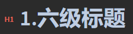
> - 源码格式：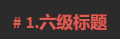
> - 快捷键：`Ctrl + 1~6`

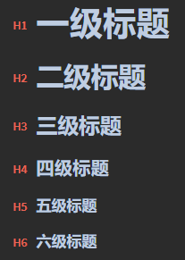

# 3.引用块

- 语法：`>` + 空格 （英文大于符号）

> 引用块（可以嵌套） `引用内容`
>
> > 嵌套引用 `引用内容`

# 4.超链接

[百度一下](https://www.baidu.com/) 、[京东](https://www.jd.com/)、<颜文字：https://emojixd.com/>

使用方法：

1. 按`Ctrl + K`设置或取消超链接
2. 按住 <kbd>Ctrl</kbd> 键+鼠标单击，将会系统默认浏览器的方式打开，并跳转至该链接地址
3. 也可用 `<` 、`>` 符号将超链接或邮箱引起来

超链接样式：

- 语法：`[超链接文本](要跳转到的超链接地址)`

- 常规：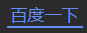
- 鼠标悬停：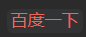
- 打开链接：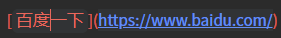

# 5.公式

注：公式、上下标、高亮、图表功能，需要在 `设置`- `Markdown` 设置面板中开启

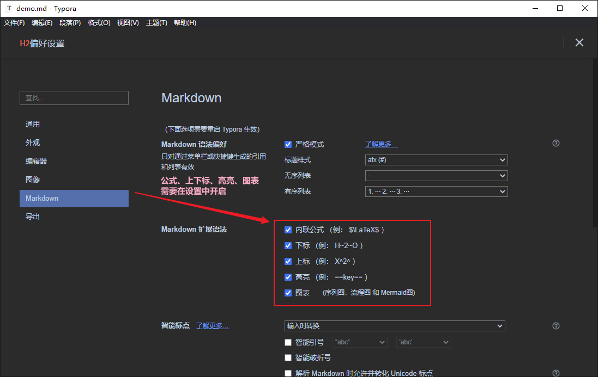

1. 内联公式：$\lim\limits_{x \to \infty} \exp(-x)=0$
   - 语法：`$公式$` ，输入前面一个 `$`，输入公式，即可自动生成公式
   - 格式 - 内联公式，也可自定义快捷键
2. 公式块：（默认居中显示）
   - 语法：`$$公式$$`，输入前两个 `$$` + Enter，输入公式，即可自动生成公式
   - 快捷键：`Ctrl + Shift + M`

$$
E_0 = mc^2 \\
\quad\text{—— Albert Einstein}
$$

==公式语法不会写，强烈推荐新手去这两个链接查看==：[latex手写公式识别](http://draw.mathpix.com/)、[latex公式编辑器](https://www.latexlive.com/)

==插入一些颜文字，可以去==：[https://emojixd.com/](https://emojixd.com/)

# 6.列表

## 6.1 有序列表

> 语法：`数字.` + 空格，一般 `1.` + 空格
>
> 快捷键：`Ctrl` + `Shift` + `[`
>
> 缩进一级/回退一级：快捷键 `Ctrl` + `]`，`Ctrl` + `[`

1. 有序列表1
   1. 下一级有序列表2
   2. 下一级有序列表2
2. 同级有序列表1

## 6.2 无序列表

> 语法：`-` + 空格
>
> 快捷键：`Ctrl` + `Shift` + `]`
>
> 缩进一级/回退一级：快捷键 `Ctrl` + `]`，`Ctrl` + `[`

- 无序列表1
  - 下一级无序列表2
    - 下一级无序列表3
    - 下一级无序列表3

- 同级无序列表1

## 6.3 任务列表

> 语法：
>
> - 未选择：`-` + 空格 + `[空格]` + 空格
> - 已选择：`-` + 空格 + `[x]` + 空格

- [ ] 未完成任务1

- [ ] 未完成任务2
- [x] 已完成任务3
- [x] 已完成任务4

# 7.文本字体

**字体**

| 字体示例               | 字体样式名称 | 语法                     | 快捷键            |
| ---------------------- | ------------ | ------------------------ | ----------------- |
| **加粗字体**           | 加粗字体     | `**加粗字体**`           | `Ctrl + B`        |
| *斜体字体*             | 斜体字体     | `*斜体字体*`             | `Ctrl + I`        |
| ==高亮字体==           | 高亮字体     | `==高亮字体==`           | 无，可自定义      |
| ==***加粗斜体高亮***== | 加粗斜体高亮 | `==***加粗斜体高亮***==` | 无，可自定义      |
| ~~删除线~~             | 删除线       | `~~删除线~~`             | `Shift + Alt + 5` |
| <u>下划线</u>          | 下划线       | `<u>下划线</u>`          | `Ctrl + U`        |

**默认标签**

| 默认标签示例                                          | 字体样式名称                                           | 语法                                                        | 快捷键       |
| ----------------------------------------------------- | ------------------------------------------------------ | ----------------------------------------------------------- | ------------ |
| <font style="background-color:red">红色标签</font>    | 红色标签（可通过设置`background-color`属性控制背景色） | `<font style="background-color:red">红色标签文本</font>`    | 无，可自定义 |
| <font style="background-color:green">绿色标签</font>  | 绿色标签（可通过设置`background-color`属性控制背景色） | `<font style="background-color:green">绿色标签文本</font>`  | 无，可自定义 |
| <font style="background-color:blue">蓝色标签</font>   | 蓝色标签（可通过设置`background-color`属性控制背景色） | `<font style="background-color:blue">蓝色标签文本</font>`   | 无，可自定义 |
| <font style="background-color:yellow">黄色标签</font> | 黄色标签（可通过设置`background-color`属性控制背景色） | `<font style="background-color:yellow">黄色标签文本</font>` | 无，可自定义 |
| <font style="background-color:gray">灰色标签</font>   | 蓝色标签（可通过设置`background-color`属性控制背景色） | `<font style="background-color:gray">灰色标签文本</font>`   | 无，可自定义 |

**自定义标签**

| 自定义标签示例                       | 字体样式名称         | 语法                                                         | 快捷键       |
| ------------------------------------ | -------------------- | ------------------------------------------------------------ | ------------ |
| <font>红色标签</font>                | 瑰红标签（主题定义） | `<font>红色标签文本</font>` 或 `<font title="red">红色标签文本</font>` | 无，可自定义 |
| <font title="green">绿色标签</font>  | 浅绿标签（主题定义） | `<font title="green">绿色标签文本</font>`                    | 无，可自定义 |
| <font title="blue">蓝色标签</font>   | 淡蓝标签（主题定义） | `<font title="blue">红色标签文本</font>`                     | 无，可自定义 |
| <font title="yellow">黄色标签</font> | 橙黄标签（主题定义） | `<font title="yellow">黄色标签文本</font>`                   | 无，可自定义 |
| <font title="gray">灰色标签</font>   | 暗灰标签（主题定义） | `<font title="gray">灰色标签文本</font>`                     | 无，可自定义 |

**强调格式**

| 自定义强调格式示例                  | 字体样式名称 | 语法                                  | 快捷键       |
| ----------------------------------- | ------------ | ------------------------------------- | ------------ |
| <span alt="underline">下划线</span> | 下划线       | `<span alt="underline">下划线</span>` | 无，可自定义 |
| <span alt="emp">着重号</span>       | 着重号       | `<span alt="emp">着重号</span>`       | 无，可自定义 |
| <span alt="wavy">波浪线</span>      | 波浪线       | `<span alt="wavy">波浪线</span>`      | 无，可自定义 |
| <span alt="hide">隐藏文本</span>    | 隐藏文本     | `<span alt="hide">隐藏文本</span>`    | 无，可自定义 |

**其它字体样式**（源于网上，网上一大堆，不再一一列举）

| 其它字体样式示例                    | 字体样式名称 | 语法                                  | 快捷键       |
| ----------------------------------- | ------------ | ------------------------------------- | ------------ |
| <span alt="rainbow">彩虹字体</span> |              | `<span alt="rainbow">彩虹字体</span>` | 无，可自定义 |
| <span alt="modern">模型字体</span>  |              | `<span alt="modern">模型字体</span>`  | 无，可自定义 |
| <span alt="shake">抖音字效</span>   |              | `<span alt="shake">抖音字效</span>`   | 无，可自定义 |

# 8.代码块

> 语法：**```语言** + Enter
>
> 快捷键：`Ctrl + Shift + K`

**Java 代码**

```java
package com.baidu.java8;
import org.junit.Test;
import java.util.*;

/**
 * Java 文本注释
 */
public class TestLambda4 {
    /*
    * Java 多行注释
    */
    @Test
    public void test1() {
        happy(10000, (m) -> System.out.println("买手机，消费：" + m + " 元"));
    }

    // Java 单行注释
    public void happy(double money, Consumer<Double> con) {
        con.accept(money);
    }
}
```

**CSS 代码**

```css
/** css 注释 */
#write code,div code {
    padding: 2px 4px;
    border-radius: 2px;
    /*font-family: '微软雅黑';*/
    font-family: var(--code-font);
    font-size: 0.9rem;
    color: var(--code-color);
    background-color: var(--codebg-color);
}
```

**HTML 代码**

```html
<!---->
<!-- HTML 注释 -->
<!DOCTYPE html>
<html lang="en">
<head>
    <meta charset="UTF-8">
    <title>Title</title>
</head>
<body>
<h1>baidu</h1>
</body>
</html>
```

**JS 代码**

```js
// js 注释
function Person(first, last, age, eye) {
    this.firstName = first;
    this.lastName = last;
    this.age = age;
    this.eyeColor = eye;
}
```

**SQL 代码**

```sql
-- SQL 注释
# SQL 注释
SELECT LastName,FirstName FROM Persons
SELECT ProductName, UnitPrice, FORMAT(Now(),'YYYY-MM-DD') as PerDate
FROM Products
```

**XML 代码**

```xml
<!--  XML 注释  -->
<breakfast_menu>
    <food>
        <name>Belgian Waffles</name>
        <price>$5.95</price>
        <description>two of our famous Belgian Waffles</description>
        <calories>650</calories>
    </food>
</breakfast_menu>
```

**PHP 代码**

```php
// PHP 单行注释
# PHP 单行注释

/*
PHP 多行注释块
*/
<?php
$con = mysql_connect("localhost","peter","abc123");
if (!$con)
  {
  die('Could not connect: ' . mysql_error());
  }

mysql_select_db("my_db", $con);

mysql_query("DELETE FROM Persons WHERE LastName='Griffin'");

mysql_close($con);
?>
```

**Python 代码**

```python
# Python 注释
def decorator(func):
    def wrapper(*args, **kwargs):
        ...
        return func(*args, **kwargs)
    return wrapper
```

**C 代码**

```c
// C 单行注释
#include <stdio.h>
void bubble_sort(int arr[], int len) {
    int i, j, temp;
    for (i = 0; i < len - 1; i++)
        for (j = 0; j < len - 1 - i; j++)
            if (arr[j] > arr[j + 1]) {
                temp = arr[j];
                arr[j] = arr[j + 1];
                arr[j + 1] = temp;
            }
}

/** C 多行注释 */
int main() {
    int arr[] = { 22, 34, 3, 32, 82, 55, 89, 50, 37, 5, 64, 35, 9, 70 };
    int len = (int) sizeof(arr) / sizeof(*arr);
    bubble_sort(arr, len);
    int i;
    for (i = 0; i < len; i++)
        printf("%d ", arr[i]);
    return 0;
}
```

**C++ 代码**

```c++
// C++ 单行注释
#include <iostream>
// C++ 多行注释
#include <pthread.h>
 
using namespace std;
 
#define NUM_THREADS 5
 
// 线程的运行函数
void* say_hello(void* args)
{
    cout << "Hello Runoob！" << endl;
    return 0;
}
 
int main()
{
    // 定义线程的 id 变量，多个变量使用数组
    pthread_t tids[NUM_THREADS];
    for(int i = 0; i < NUM_THREADS; ++i)
    {
        //参数依次是：创建的线程id，线程参数，调用的函数，传入的函数参数
        int ret = pthread_create(&tids[i], NULL, say_hello, NULL);
        if (ret != 0)
        {
           cout << "pthread_create error: error_code=" << ret << endl;
        }
    }
    //等各个线程退出后，进程才结束，否则进程强制结束了，线程可能还没反应过来；
    pthread_exit(NULL);
}
```

**增减行代码块**

```diff
+ 新增行
- 删除行
其他行
```

# 9.表格

| 表头1  | 表头2 | 表头3 |
| :----- | :---: | ----: |
| 奇数行 |  列   |    列 |
| 偶数行 |  ...  |   ... |
| ...    |       |       |
| ...    |       |       |

# 10.上下标

1. 上标：e^2^，e^x^
   - 语法：`x^上标^` （x：任意字符、文本，上标也可以是任意字符、文本）
2. 下标：H~2~，O~2~，H~2~O，H~52~O~12\ 22\ 78~ （若下标是多个单词或字符，需使用 `\` 转义空格，显示特殊字符一般都需要反斜杠 `\` 转义）
   - 语法：`x~下标1\ 下标2~` （x：任意字符、文本，上标也可以是任意字符、文本）
3. 拼音文字：（很少使用，没啥用）<ruby>下方文字<rp> (</rp><rt>上方文字</rt><rp>) </rp></ruby>、<ruby>拼音文字<rp> (</rp><rt>Pīn yīn wén zì</rt><rp>) </rp></ruby>、<ruby>没卵用<rp> (</rp><rt>使い物にならない</rt><rp>) </rp></ruby>
   - 语法：`<ruby>拼音文字<rp> (</rp><rt>Pīn yīn wén zì</rt><rp>) </rp></ruby>`（原理：就是两种文字叠加，没卵用）

# 11.图片

图片居左显示，可以设置图片大小、是否阴影、模糊等

- 语法：``（右键也可以缩放图片，任意缩放图片：style="zoom: 任意比例%，显示阴影：alt="shadow"，模糊：alt="blur"）


# 12.嵌入音视频

**嵌入音频**

注：我这里是相对路径，音乐文件是本地音乐文件，嵌入外链似乎不得行

```html
语法：
<!-- 方式 ① -->
<audio src="./本地音乐文件路径/xxx.mp3"></audio>

<!-- 方式 ② -->
<audio controls="controls">
  <source src="./本地音乐文件路径/xxx.mp3" type="audio/mp3" />
</audio>

若需要居中显示，可以将 <audio> 音频包裹在<center></center> 中，如下所示：
<center><audio src="./temp/她的微笑.mp3"></audio></center>
    
嵌入外链，语法大致是：//music.163.com/outchain/player?type=2&id=1342183925&auto=0 为外链音乐文件，我试了一下网易云，没能成功，播放不了
<iframe frameborder="no" border="0" marginwidth="0" marginheight="0" src="//music.163.com/outchain/player?type=2&id=1342183925&auto=0"></iframe>
```

<audio src="./temp/她的微笑.mp3"></audio>

<audio controls="controls">
  <source src="./temp/你能不能不要离开我 (莫叫语版)-莫叫姐姐.mp3" type="audio/mp3" />
</audio>
**嵌入视频**

```html
语法：
<video src="./本地视频文件路径/xxx.mp4"></video>
```

<video src="./temp/航拍风景.mp4"></video>

**折叠标签**

语法：

```html
<details>
    <summary>折叠标签</summary>
    <!-- 折叠标签内容 -->
    越人歌
    佚名 〔先秦〕
    今夕何夕兮，搴舟中流。
    今日何日兮，得与王子同舟。
    蒙羞被好兮，不訾诟耻。
    心几烦而不绝兮，得知王子。
    山有木兮木有枝，心悦君兮君不知。
</details>
```

<details>
    <summary>越人歌</summary>
    佚名 〔先秦〕
    今夕何夕兮，搴舟中流。
    今日何日兮，得与王子同舟。
    蒙羞被好兮，不訾诟耻。
    心几烦而不绝兮，得知王子。
    山有木兮木有枝，心悦君兮君不知。
</details>

**更多关于Typora对HTML的支持，请看官方文档**：[https://support.typora.io/HTML/](https://support.typora.io/HTML/)

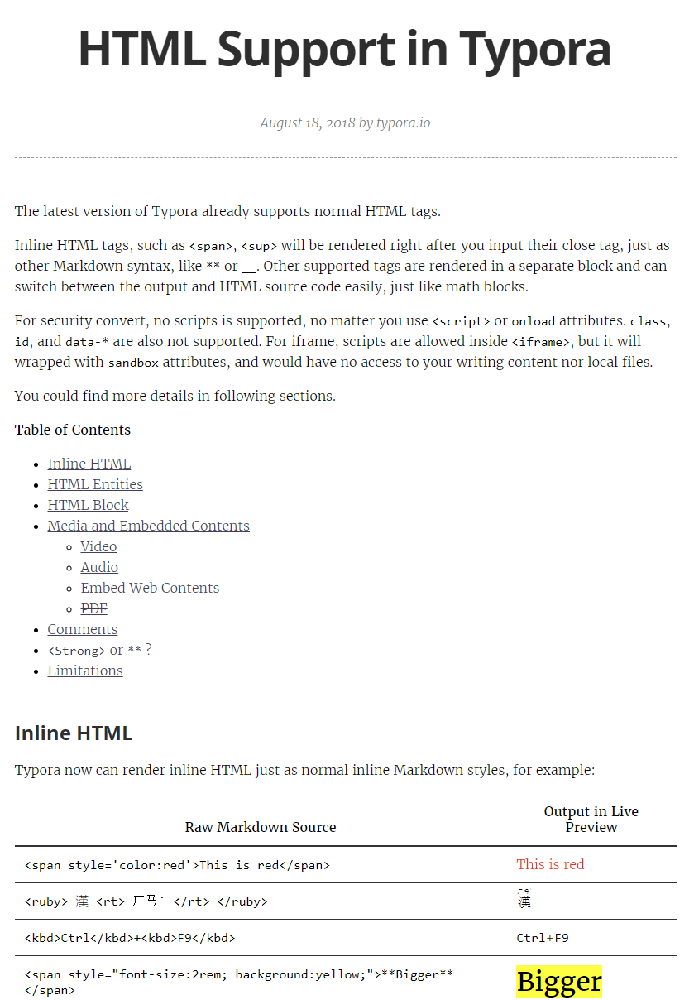

# 13.表情符号

**表情符号，去看这个链接**：[https://www.webfx.com/tools/emoji-cheat-sheet/](https://www.webfx.com/tools/emoji-cheat-sheet/)

"微笑"：:smile:（`:smile:`），"笑哭"：&#128514;（`&#128514;`）、&#x1F602;（`&#x1F602;`）......

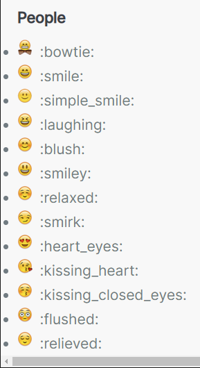

# 14.饼图

语法：（这里仅举例说明，更多自己参考[官方文档](https://www.webfx.com/tools/emoji-cheat-sheet/)）

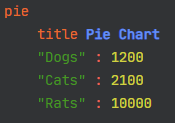

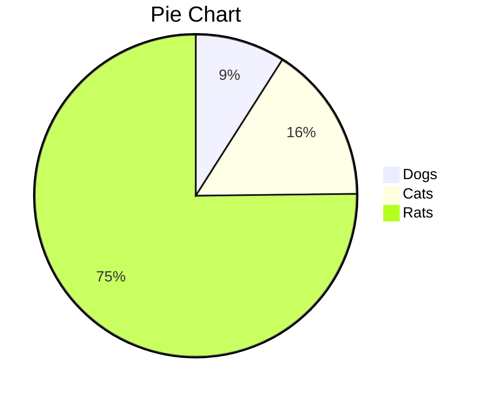

# 15.分割线

语法：`---` + Enter 或 `*** ` + Enter

---

[^1]:Typora 官方下载地址：https://typora.io/#download
[^2]:Typora 官方官方支持文档：https://support.typora.io/
[^3]:Typora 官网附属的一些主题：https://theme.typora.io/

